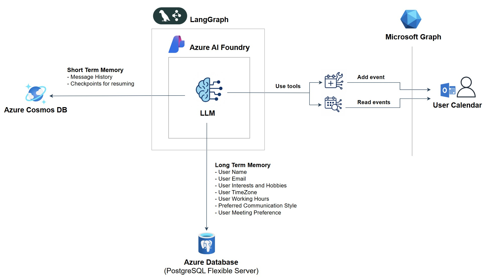

# LangGraph AI Assistant Agent - Proof of Concept



## Project Overview

This proof-of-concept showcases how [LangGraph](https://www.langchain.com/langgraph) powers AI-driven workflows equipped with short-term and long-term memory, extending AI capabilities through seamless integration with Microsoft 365. As a Cloud Architect, I was also curious how well it could integrate with Azure's enterprise-grade infrastructure.

> [!NOTE]
> For a detailed explanation of this solution, check out the accompanying blog post: [Leveraging Agentic LangGraph AI with Azure and Microsoft Graph](https://rafal.hollins.io/blog/leveraging-agentic-langgraph-ai-with-azure-and-microsoft-graph)

Key features:

- 💬 **Natural language scheduling** - Create and retrieve calendar events through conversation rather than clicking through menus.

- 👤 **Persistent user profiles** - The system learns your timezone, working hours, and preferences, then uses that context to provide better responses.

- 💾 **Memory across sessions** - Conversations and user data persist between sessions using dual storage—short-term for threads, long-term for profiles.

- 🏢 **Enterprise grade integration** - Handles multiple concurrent users with thread-safe operations and utilize Azure infrastructure components like [Azure AI Foundry](https://azure.microsoft.com/en-us/products/ai-studio/), [Azure Cosmos DB](https://azure.microsoft.com/en-us/products/cosmos-db/), [Azure Database for PostgreSQL](https://azure.microsoft.com/en-us/products/postgresql/).

## Prerequisites

> [!WARNING]
> As a best practice when playing around with POCs, including this one, it's always safest to set everything up in a sandbox environment and use a completely isolated Entra ID tenant and Azure subscription.

Before getting started, ensure you have the following prerequisites set up:

### 🧪 Lab environment with Jupyter

Set up a environment using [Jupyter](https://jupyter.org/) in Docker. This provides an isolated, reproducible workspace for running code and experiments.

The project includes a `dockerfile` that you can use to build your development environment. To get started:

1. Build the Docker image:
   ```bash
   docker build -t my-jupyter .
   ```

2. Run the container with all required environment variables:
   ```bash
   docker run -d \
     -e LANGCHAIN_TRACING_V2="true" \
     -e LANGSMITH_ENDPOINT="https://api.smith.langchain.com" \
     -e LANGCHAIN_API_KEY="<your-langchain-api-key>" \
     -e LANGCHAIN_PROJECT="default" \
     -e COSMOSDB_ENDPOINT="<your-cosmosdb-endpoint>" \
     -e COSMOSDB_KEY="<your-cosmosdb-key>" \
     -e AZURE_OPENAI_API_KEY="<your-azure-openai-api-key>" \
     -e AZURE_OPENAI_ENDPOINT="<your-azure-openai-endpoint>" \
     -e CLIENT_ID="<your-client-id>" \
     -e CLIENT_SECRET="<your-client-secret>" \
     -e TENANT_ID="<your-tenant-id>" \
     -e POSTGRES_HOST="<your-postgres-host>" \
     -e POSTGRES_PORT="5432" \
     -e POSTGRES_DB="<your-postgres-db>" \
     -e POSTGRES_USER="<your-postgres-user>" \
     -e POSTGRES_PASSWORD="<your-postgres-password>" \
     -p 8888:8888 \
     -w /app my-jupyter
   ```

3. Visit `http://127.0.0.1:8888` in your browser and use the token provided in the terminal to log in. 

4. You will also need the [Jupyter VS Code extension](https://marketplace.visualstudio.com/items?itemName=ms-toolsai.jupyter) for the best development experience.

### 🦜 LangGraph/LangSmith Account

Sign up for a [LangSmith](https://smith.langchain.com/) account and obtain your API key. This is required for LangGraph tracing and monitoring your AI workflows.

### 🔐 App Registration in EntraID

Register an application in Microsoft Entra ID and grant it API permissions to read and write to user calendar. Please refer to the [O365 Python documentation](https://o365.github.io/python-o365/latest/getting_started.html#permissions) for detailed setup instructions.

Required permissions:
- `Calendars.ReadWrite`
- `User.Read`

### ☁️ Deployed Azure Resources

The following Azure services need to be deployed and configured. For security, restrict access by allowing only specific public IP addresses:

- **[Azure AI Foundry](https://azure.microsoft.com/en-us/products/ai-studio/)** - For AI model hosting and management
- **[Azure Cosmos DB](https://azure.microsoft.com/en-us/products/cosmos-db/)** - For short-term memory storage
- **[Azure Database for PostgreSQL Flexible Server](https://azure.microsoft.com/en-us/products/postgresql/)** - For long-term memory storage

## Getting Started

1. Clone this repository
2. Set up all prerequisites listed above
3. Build and run the Docker container with your environment variables
4. Open `personal_assistant.ipynb` in Jupyter or VS Code
5. Follow the notebook instructions to explore the AI assistant capabilities